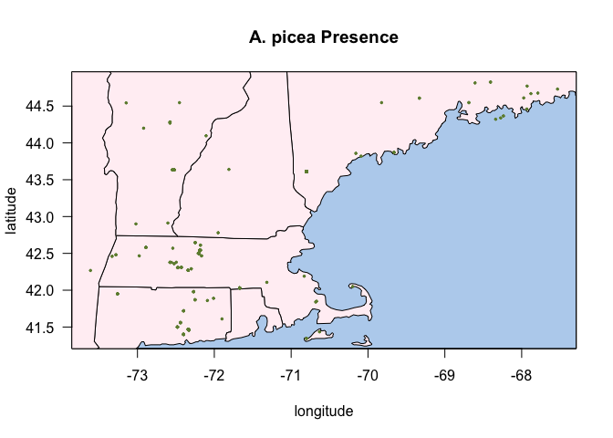

Data Summary
============

    ##   latitude longitude   ant.species
    ## 1  44.5000  -72.5100 rudis complex
    ## 2  43.6230  -72.5190 tennesseensis
    ## 3  44.2380  -70.0350 rudis complex
    ## 4  41.4903  -71.5071 rudis complex
    ## 5  43.1474  -70.9445 rudis complex
    ## 6  43.1474  -70.9445 rudis complex

    ## 
    ##         fulva        fulva          picea        picea          rudis 
    ##           428           224           507            28           636 
    ##        rudis  rudis complex tennesseensis       treatae 
    ##            14           539            15             9

Results Summary
===============

Analysis and Results
====================

Input/Outputs
-------------

Dependencies
------------

Load Data
---------

-   Use datasets HF147-12 and HF147-15
-   Data are hosted by the Environmental Data Initiative and the HF
    Archive
-   EDI has an API for R
    !(EDIutils)\[<a href="https://github.com/EDIorg/EDIutils" class="uri">https://github.com/EDIorg/EDIutils</a>\]
-   Data from HF archive can be sourced with URL, this is less desirable
    as URLS could change
-   Make sure to remove duplicated rows (see `unique()`)
-   Relevant species are:
    -   *Aphaenogaster picea*
    -   *A. fulva*
    -   *A. tenneseensis*
    -   *A. treatae*
    -   *A. rudis*
    -   aphNA = un-assignable specimens
