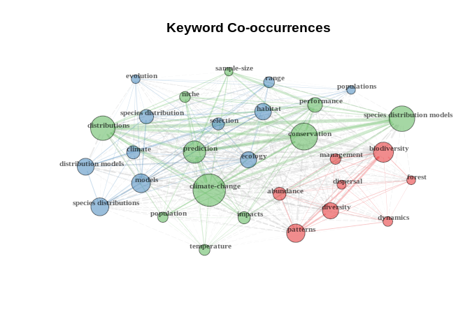
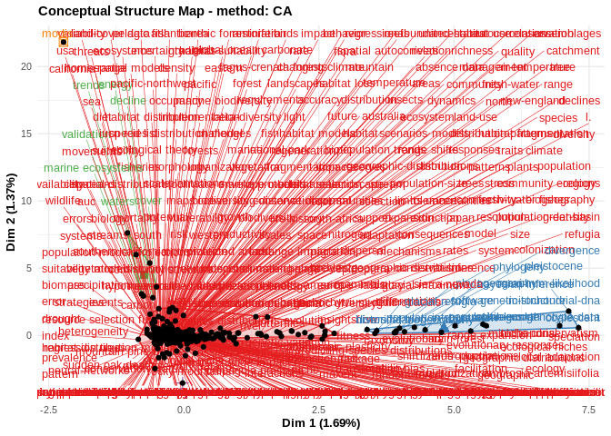
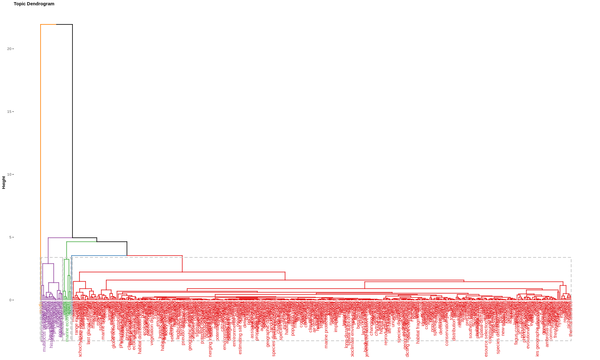
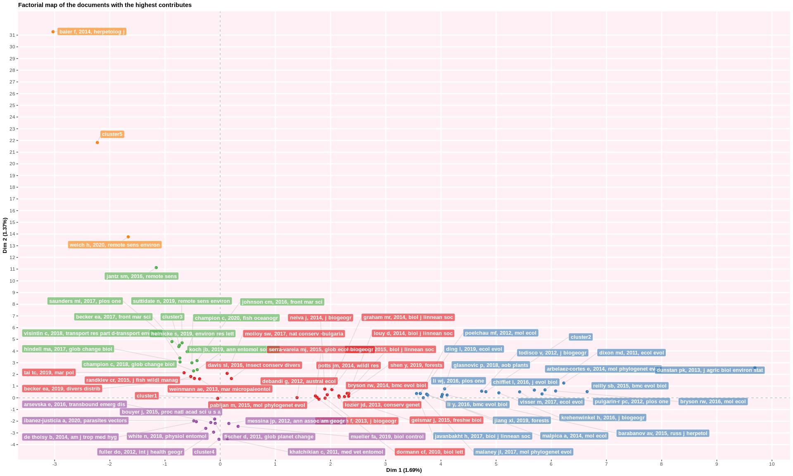
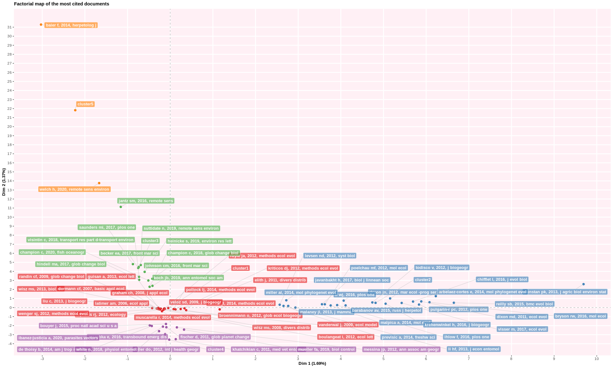
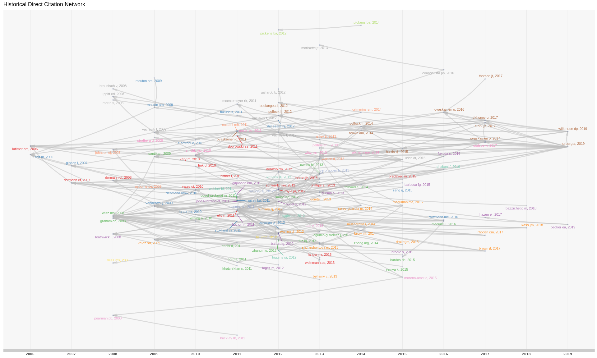

### Make a table of the articles

### review, year, author, title, keywords

Much of the following code is adapted from
<https://cran.r-project.org/web/packages/bibliometrix/vignettes/bibliometrix-vignette.html>.

    if (!(any(installed.packages()[, 1] == "bibliometrix"))){
        install.packages("bibliometrix")
    }

    library(bibliometrix)

    ## To cite bibliometrix in publications, please use:
    ## 
    ## Aria, M. & Cuccurullo, C. (2017) bibliometrix: An R-tool for comprehensive science mapping analysis, Journal of Informetrics, 11(4), pp 959-975, Elsevier.
    ##                         
    ## 
    ## http:\\www.bibliometrix.org
    ## 
    ##                         
    ## To start with the shiny web-interface, please digit:
    ## biblioshiny()

    bib.df  <-  convert2df("../docs/bib/combined.bib", dbsource = "wos", format = "bibtex")

    ## 
    ## Converting your wos collection into a bibliographic dataframe
    ## 
    ## Done!
    ## 
    ## 
    ## Generating affiliation field tag AU_UN from C1:  Done!

                                            # restrict to articles
    bib.df <- bib.df[bib.df[, "DT"] == "ARTICLE", ]
    year  <- bib.df[, "PY"]
    ead <- do.call(rbind, strsplit(bib.df[, "early.access.date"], " "))[, 2]
    year[is.na(year)] <- ead[is.na(year)]

    if (!(any(dir("../data/") == "genm_biblio.csv"))){
        author <- sapply(bib.df[, "AU"], function(x) strsplit(x, ";")[[1]][1], USE.NAMES = FALSE)
        review <- grepl("REVIEW", bib.df[, "TI"], ignore.case = TRUE) | 
            grepl("REVIEW", bib.df[, "DE"], ignore.case = TRUE) | 
            grepl("REVIEW", bib.df[, "ID"], ignore.case = TRUE) | 
            grepl("REVIEW", bib.df[, "web.of.science.categories."], ignore.case = TRUE)
        review <- as.numeric(review)
        kw <- apply(bib.df[, c("DE", "ID")], 1, paste, collapse = "; ")
        kw <- gsub(";;", ";", kw)
        kw <- gsub(";;;", ";", kw)
        kw <- lapply(kw, function(x) unique(strsplit(x, split = "; ")[[1]]))
        kw  <- unlist(lapply(kw, paste, collapse = "; "))
        kw <- as.character(kw)
        gene <- grepl("gene", bib.df[, "TI"], ignore.case = TRUE) | 
            grepl("gene", kw, ignore.case = TRUE) | 
            grepl("gene", bib.df[, "web.of.science.categories."], ignore.case = TRUE)
        gene <- as.numeric(gene)
        out <- data.frame(year, author, title = bib.df[, "TI"], review, gene, kw)
        out <- out[order(as.numeric(out[, "year"]), decreasing = TRUE),]
        write.csv(file = "../data/genm_biblio.csv", out, row.names = FALSE)
    }

Figures
=======

    NetMatrix <- biblioNetwork(bib.df, analysis = "co-occurrences", 
                               network = "keywords", sep = ";")

    par(mfrow = c(1,1))
    net <- networkPlot(NetMatrix, normalize="association", weighted=T, n = 30, 
                       Title = "Keyword Co-occurrences", type = "fruchterman", 
                       size=T,edgesize = 5,labelsize=0.7)

    CS <- conceptualStructure(bib.df, field="ID", method="CA", minDegree=4, clust=5, 
                              stemming=FALSE, labelsize=10, documents=20)

    options(width=130)
    par(mfrow = c(1,1))
    M <- metaTagExtraction(bib.df, Field = "AU_CO", sep = ";")
    histResults <- histNetwork(M, min.citations = 1, sep = ";")

    ## 
    ## WOS DB:
    ## Searching local citations (LCS) by reference items (SR) and DOIs...
    ## 
    ## Analyzing 84259 reference items...
    ## 
    ## Found 368 documents with no empty Local Citations (LCS)

    set.seed(12345)
    hist.net <- histPlot(histResults, n=100, size = 1, labelsize=3, verbose = FALSE)

